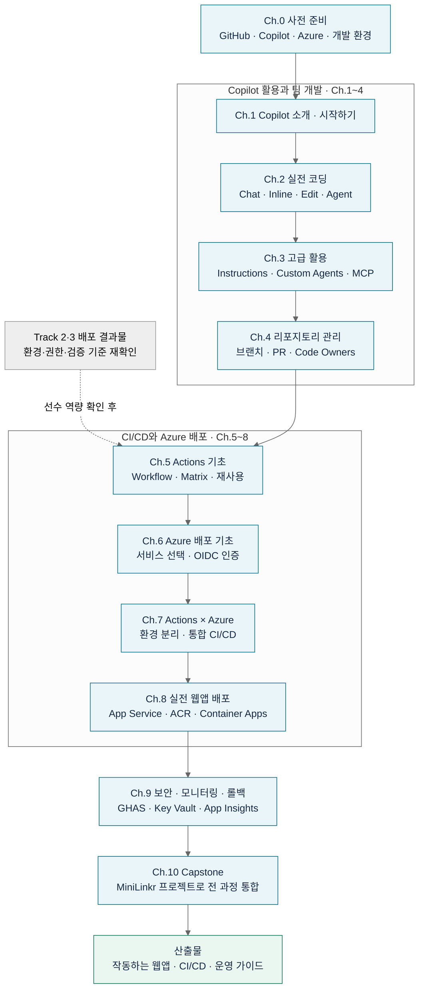
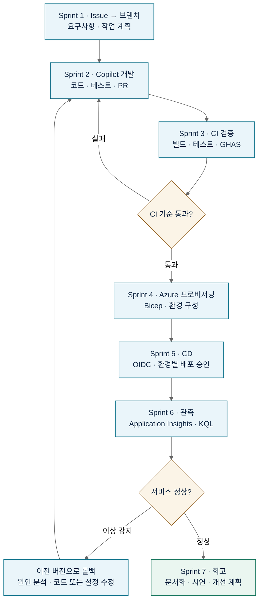

# 🚀 Copilot Advanced: GitHub × Azure DevOps

> **개발자를 위한 GitHub Copilot 심화 커리큘럼 — 코딩부터 리포 관리, Azure 배포 자동화까지**
> 이론 20% + 실습 80% · 한국어 · 챕터당 30~60분

## 전체 교육 flow

**Copilot으로 개발 → GitHub에서 협업 → Actions로 검증 → Azure 배포 → 관측과 롤백**을 하나의 흐름으로 학습합니다.
먼저 Ch.0~9로 필요한 기술을 익히고, Ch.10에서 전체 과정을 하나의 프로젝트로 연결합니다.

**Track 2·3에서 첫 배포를 경험했다면:** [트랙 연결 가이드](docs/track2-track3-bridge.md)를 통해
자신의 MSA·정적 웹·Python 앱에 자동화·승인·관측·롤백을 붙입니다.
Track 2·3은 첫 배포, 이 Track 4는 반복 가능한 배포와 운영 체계를 목표로 하며 기존 독립 수강 경로도 유지합니다.

### 1. 챕터별 학습 경로



챕터 문서와 소요 시간: [챕터 지도](#-챕터-지도)

### 2. Capstone에서 완성하는 개발·배포 흐름



실습 가이드: [Ch.10 종합 실습 Capstone](docs/ch10_종합_실습_Capstone.md)

실행 가능한 대표 배포 경로: [Ch.7~9 App Service 슬롯 실습](examples/01-web-app/README.md).
소스·테스트·Bicep·수동 Actions 워크플로로 OIDC·실패 차단·승인·배포·롤백을 연습합니다.
MiniLinkr 전체 또는 모든 Azure 배포 방식의 검증을 대신하지 않습니다.

---

## 이 커리큘럼이 필요한 이유

GitHub Copilot을 "코드 자동완성 도구" 정도로만 알고 계신가요? 실제로는 **아이디어 → 코드 → 리뷰 → 배포 → 모니터링**까지 개발 라이프사이클 전체를 가속화하는 도구입니다. 이 과정은 Copilot의 다양한 모드를 실전에서 활용하는 방법과, GitHub 리포지토리 운영·Azure 배포 자동화까지 **하나의 흐름**으로 이어서 배웁니다.

| 흔한 오해 | 실제 |
| :--- | :--- |
| "자동완성이 전부다" | Chat · Edit · Agent · Custom Agents까지 활용해야 진짜 생산성 |
| "Copilot이 만든 코드는 그대로 쓰면 된다" | 검토 · GHAS 스캔 · 테스트를 파이프라인에 넣어야 안전 |
| "배포는 인프라 담당자가 하는 것" | GitHub Actions로 앱 개발자도 배포 소유권을 가짐 |
| "Azure는 복잡해서 배우기 어렵다" | 앱 개발자용 3개 서비스(App Service · Container Apps · Static Web Apps)만 알면 충분 |

**커리큘럼 원칙**

1. 이론 20% + 실습 80% — 손으로 직접 해봐야 남습니다
2. 실제 현업에서 마주치는 시나리오 기반 (가짜 튜토리얼 X)
3. 모든 프롬프트·YAML은 그대로 복사해서 쓸 수 있는 형태로 제공
4. Copilot 결과를 **검증하는 습관**을 함께 훈련
5. 보안(GHAS · Key Vault)과 운영(모니터링 · 롤백)을 처음부터 함께 다룸

---

## 대상 및 학습 목표

**대상**

- 최근 GitHub Copilot을 도입했거나 도입 예정인 **주니어~미드레벨 개발자**
- CI/CD 파이프라인을 처음 만들어보는 **백엔드·풀스택 개발자**
- Azure 배포 자동화를 담당하게 된 **DevOps 엔지니어**
- 팀에 GitHub 문화를 정착시키려는 **테크 리드·시니어**

**수료 후 할 수 있는 것**

- [x] GitHub Copilot 4가지 모드(Chat · Inline · Edit · Agent)를 상황별로 선택해 사용
- [x] `.github/copilot-instructions.md`로 팀 컨벤션을 Copilot에 학습
- [x] MCP 서버를 연결해 Copilot으로 DB · 사내 API 조회
- [x] Trunk-based / GitHub Flow 브랜치 전략을 팀에 도입
- [x] GitHub Actions로 빌드 · 테스트 · 배포 파이프라인 구축
- [x] OIDC 인증으로 Azure에 시크릿 없이 배포 (Federated Credentials)
- [x] Azure App Service · Container Apps 무중단 배포 및 롤백
- [x] Application Insights로 배포 후 이슈 자동 감지

---

## 📚 챕터 지도

시작 전 반드시 [`docs/00_사전준비.md`](docs/00_사전준비.md)를 완료하세요.

| # | 챕터 | 소요 시간 | 난이도 | 핵심 키워드 |
| :--- | :--- | :--- | :--- | :--- |
| **0** | [사전 준비](docs/00_사전준비.md) | 30분 | 🟢 | 계정, 라이선스, VS Code, Azure 구독 |
| **1** | [Copilot 소개 및 시작하기](docs/ch01_Copilot_소개_및_시작하기.md) | 40분 | 🟢 | Copilot 개요, 요금제, 첫 완성, 프롬프트 |
| **2** | [Copilot 실전 코딩](docs/ch02_Copilot_실전_코딩.md) | 60분 | 🟢 | Chat, Inline, Edit, Agent, 리팩터링, 테스트 |
| **3** | [Copilot 고급 활용 — Custom Agents & MCP](docs/ch03_Copilot_고급_활용_Custom_Agents_MCP.md) | 60분 | 🟡 | `copilot-instructions.md`, Custom Agents, MCP |
| **4** | [GitHub 리포지토리 관리](docs/ch04_GitHub_리포지토리_관리.md) | 50분 | 🟢 | 브랜치 전략, PR, Code Owners, Issue, Projects |
| **5** | [GitHub Actions 기초](docs/ch05_GitHub_Actions_기초.md) | 60분 | 🟡 | Workflow YAML, 이벤트, Matrix, 시크릿, Reusable Workflow |
| **6** | [Azure 배포 기초](docs/ch06_Azure_배포_기초.md) | 50분 | 🟡 | Resource Group, App Service, Container Apps, OIDC |
| **7** | [GitHub Actions × Azure 통합 CI/CD](docs/ch07_GitHub_Actions_Azure_통합_CICD.md) | 60분 | 🟡 | `azure/login`, Federated Credentials, 환경 분리 |
| **8** | [실전 웹앱 배포 자동화](docs/ch08_실전_웹앱_배포_자동화.md) | 90분 | 🟠 | Node.js/Python → App Service, Docker → ACR → Container Apps |
| **9** | [보안 · 모니터링 · 롤백](docs/ch09_보안_모니터링_롤백.md) | 60분 | 🟠 | Key Vault, GHAS, 배포 승인, 슬롯 스왑, App Insights |
| **10** | [종합 실습 Capstone](docs/ch10_종합_실습_Capstone.md) | 120분 | 🔴 | 아이디어 → Copilot 개발 → GitHub 관리 → Azure 배포 → 관측 |

**전체 총 소요 시간**: 약 12~14시간 (2일 워크숍 또는 2주 스터디 권장)

---

## 사전 준비 체크리스트

**필수**

- [ ] GitHub 계정 ([github.com](https://github.com/) 가입)
- [ ] GitHub Copilot 라이선스 (Individual $10/월, Business $19/월, Enterprise $39/월 중 택1)
- [ ] VS Code 최신 버전 + `GitHub Copilot`, `GitHub Copilot Chat` 확장
- [ ] Git 2.40+ 로컬 설치
- [ ] Azure 구독 (신규 가입 시 $200 크레딧 · 30일)
- [ ] Azure CLI 2.60+ 설치 (`az --version` 확인)
- [ ] Node.js 22.13+ 또는 Python 3.11+ (실습 예제 언어·Azure 지원 런타임에 맞춰 선택)

**권장**

- [ ] Docker Desktop (컨테이너 실습용 · Ch.8)
- [ ] GitHub CLI (`gh`) — Copilot으로 이슈·PR 생성 실습용
- [ ] `mcp` 클라이언트 지원 VS Code 최신 채널

자세한 설치 가이드는 [`docs/00_사전준비.md`](docs/00_사전준비.md)에서 확인하세요.

---

## 학습 방법 (권장)

### 1️⃣ 혼자 학습 (12~14시간)

Ch.0부터 순차 진행. 각 챕터 끝의 **실습 과제**는 반드시 직접 수행하세요. 눈으로 읽기만 해서는 손에 남지 않습니다.

### 2️⃣ 팀 워크숍 (2일 집중)

| 일차 | 오전 (3h) | 오후 (3h) |
| :--- | :--- | :--- |
| Day 1 | Ch.0~2 (Copilot 활용) | Ch.3~4 (Custom Agents + Repo 관리) |
| Day 2 | Ch.5~7 (Actions + Azure 통합) | Ch.8~10 (실전 배포 + Capstone) |

강사 1명 + 참가자 8~15명 규모 권장. 각 챕터 끝 실습은 페어 프로그래밍으로 진행.

### 3️⃣ 팀 스터디 (5주 코스)

| 주차 | 진도 |
| :--- | :--- |
| Week 1 | Ch.0~2 |
| Week 2 | Ch.3~4 |
| Week 3 | Ch.5~6 |
| Week 4 | Ch.7~8 |
| Week 5 | Ch.9~10 |

주 1회 90분 스터디 + 각자 실습 완료 후 짧은 회고.

---

## 프로젝트 구조

```
Copilot-Advanced-Azure-DevOps/
├── README.md                                    # 이 파일
├── LICENSE                                      # MIT
├── docs/                                        # 챕터별 교육 자료
│   ├── 00_사전준비.md
│   ├── ch01_Copilot_소개_및_시작하기.md
│   ├── ch02_Copilot_실전_코딩.md
│   ├── ch03_Copilot_고급_활용_Custom_Agents_MCP.md
│   ├── ch04_GitHub_리포지토리_관리.md
│   ├── ch05_GitHub_Actions_기초.md
│   ├── ch06_Azure_배포_기초.md
│   ├── ch07_GitHub_Actions_Azure_통합_CICD.md
│   ├── ch08_실전_웹앱_배포_자동화.md
│   ├── ch09_보안_모니터링_롤백.md
│   └── ch10_종합_실습_Capstone.md
├── examples/                                    # 실습용 샘플 프로젝트
│   └── 01-web-app/                              # 실행 가능한 App Service 슬롯 예제
├── .github/
│   └── workflows/azure-slot-lab.yml              # 수동 실행 · 승인 · 버전 검증 · 롤백
```

Container Apps와 MiniLinkr는 챕터 안의 코드·과제로 구성하며 완성 앱 디렉터리가 제공된 것으로 가정하지 않습니다.

---

## 관련 자료

- **비개발자용 Copilot 심화 과정**: [Copilot-Advanced-NonDev](https://github.com/Ai-Advanced/Copilot-Advanced-NonDev) (기획, 디자이너, 마케터 등 8개 직군)
- **GHAS + Custom Agent 심화**: [GitHub_and_Copilot](https://github.com/Ai-Advanced/GitHub_and_Copilot)
- **GitHub Copilot 공식 문서**: <https://docs.github.com/copilot>
- **GitHub Actions 공식 문서**: <https://docs.github.com/actions>
- **Azure 공식 문서**: <https://learn.microsoft.com/azure>
- **Deploy to Azure Action**: <https://github.com/Azure/actions>
- **Awesome Copilot 예제**: <https://github.com/github/awesome-copilot>

---

## 기여 / 피드백

- 오탈자 수정, 실습 예제 개선 제안: Issue 또는 PR 환영
- 새 챕터 추가 제안: Issue로 논의 후 진행

## 라이선스

MIT License — 사내 교육 자유 사용, 외부 배포 시 출처 표기 부탁드립니다.
